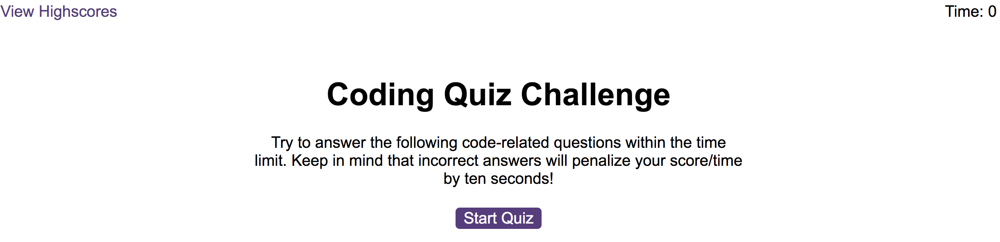
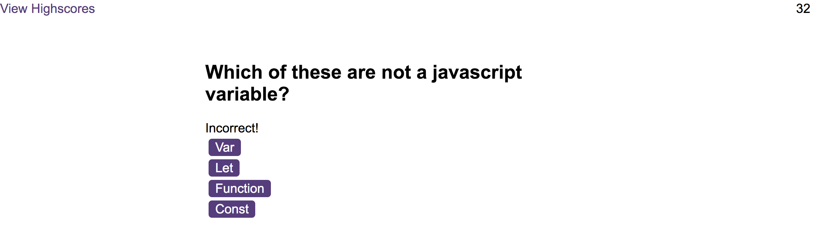
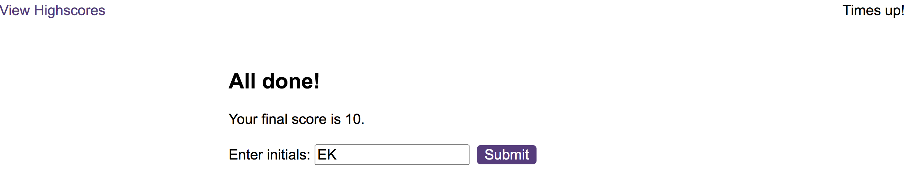
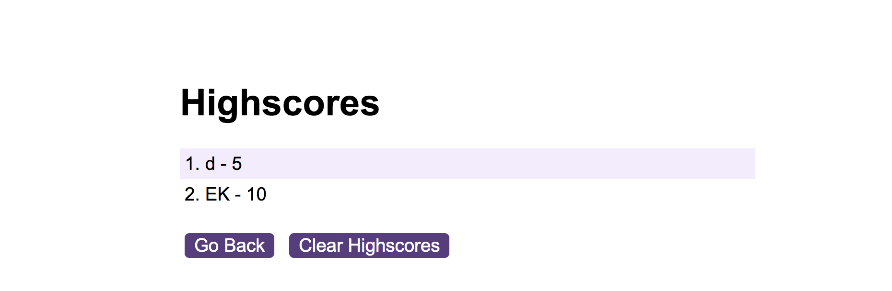

# Coding-quiz

# Description
This project was created using starter HTML and CSS code as well as developing my own JavaScript code. The aim of this project was to create a timed coding quiz that adds up the users score and saves their details to the highscore page using local storage. This project involves using functions, if statements, adding event listeners and setting and getting input to and from the local storage. During this project I found it challenging to get the highscores to stay in the local storage until the clear button was clicked. 

# Installation
N/A

# Usage
To start this coding quiz, the start quiz button must be clicked. When this is done a 60 second timer will start and the first question and set of options will appear. If the correct option is chosen 5 points will be added to the score and the next question will appear. If the incorrect option is chosen 10 seconds will be taken from the timer and the next question will appear. If the timer gets to 0 before all the questions are answered the game will be over and the score page will display where the users initals will need to be added. Otherwise when the user answers the last question the score will appear with a field to input users initials. When the submit button is then clicked that score and intials input will be stored to the local storage and the highscores page will appear. Finally, when the clear highscores button is clicked the highscores will disappear and when the back button is clicked it will return to the start page.

To access the webpage click this link: https://embow24.github.io/Coding-quiz/ 

Below are screenshots of the coding quiz showing the start page, questions, submit page and the highscores:

# Credits
Recieved support from a tutor to understand why the questions and options were only showing the first item of the quizQuestions array and how to fix this by setting a currentIndex.
Recieved support from TA to get the scores in the local storage to add to the array so that all scores are displayed on the highscores page.

# License
MIT